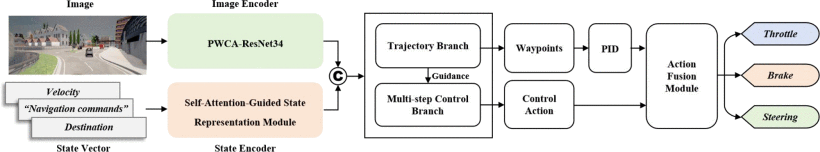
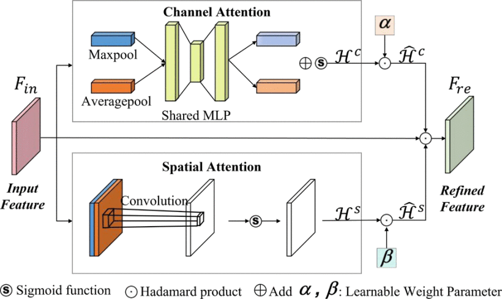
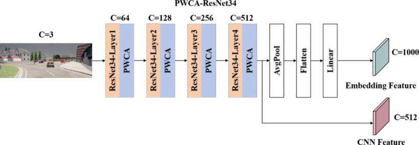
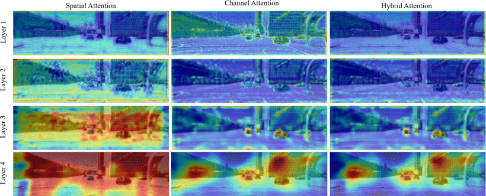

# PA-TCP: Interpretable End-to-End Autonomous Driving Through Parallel Adaptive Attention Mechanism and State Representation





> Trajectory-guided Control Prediction for End-to-end Autonomous Driving: A Simple yet Strong Baseline  
> [Dongzhuo Wang*](https://scholar.google.cz/citations?user=UOwKHNwAAAAJ&hl=zh-CN&scioq=Re-TCP)
>  - [2025 IEEE Intelligent Vehicles Symposium (IV) Paper](https://ieeexplore.ieee.org/abstract/document/11097569), IEEE IV 2025 
	
This repository contains the code for the paper [PA-TCP: Interpretable End-to-End Autonomous Driving Through Parallel Adaptive Attention Mechanism and State Representation](https://ieeexplore.ieee.org/abstract/document/11097569).


PA-TCP is a simple unified framework to combine trajectory and control prediction for end-to-end autonomous driving.


## Setup
Download and setup CARLA 0.9.10.1
```
mkdir carla
cd carla
wget https://carla-releases.s3.eu-west-3.amazonaws.com/Linux/CARLA_0.9.10.1.tar.gz
wget https://carla-releases.s3.eu-west-3.amazonaws.com/Linux/AdditionalMaps_0.9.10.1.tar.gz
tar -xf CARLA_0.9.10.1.tar.gz
tar -xf AdditionalMaps_0.9.10.1.tar.gz
rm CARLA_0.9.10.1.tar.gz
rm AdditionalMaps_0.9.10.1.tar.gz
cd ..
```

Clone this repo and build the environment

```
git clone https://github.com/wangdongzhuo/Re-TCP.git
cd PA-TCP
conda env create -f environment.yml --name PA-TCP
conda activate PA-TCP
```

```
export PYTHONPATH=$PYTHONPATH:PATH_TO_PA-TCP
```

## Dataset

Download our dataset through [Huggingface](https://huggingface.co/datasets/craigwu/tcp_carla_data) (combine the part with command `cat tcp_carla_data_part_* > tcp_carla_data.zip`) or [GoogleDrive](https://drive.google.com/file/d/1HZxlSZ_wUVWkNTWMXXcSQxtYdT7GogSm/view?usp=sharing) or [BaiduYun](https://pan.baidu.com/s/11xBZwAWQ3WxQXecuuPoexQ) (提取码 8174). The total size of our dataset is around 115G, make sure you have enough space.

## Training
First, set the dataset path in ``TCP/config.py``.
Training:
```
python TCP/train.py --gpus NUM_OF_GPUS
```

## Data Generation
First, launch the carla server,
```
cd CARLA_ROOT
./CarlaUE4.sh --world-port=2000 -opengl
```
Set the carla path, routes file, scenario file, and data path for data generation in ``leaderboard/scripts/data_collection.sh``.

Start data collection

```
sh leaderboard/scripts/data_collection.sh
```
After the data collecting process, run `tools/filter_data.py` and `tools/gen_data.py` to filter out invalid data and pack the data for training.

## Evaluation
First, launch the carla server,
```
cd CARLA_ROOT
./CarlaUE4.sh --world-port=2000 -opengl
```
Set the carla path, routes file, scenario file, model ckpt, and data path for evaluation in ``leaderboard/scripts/run_evaluation.sh``.

Start the evaluation

```
sh leaderboard/scripts/run_evaluation.sh
```

## Citation

If you find our repo or our paper useful, please use the following citation:

```
@INPROCEEDINGS{11097569,
  author={Wang, Dongzhuo and Li, Yang and Chen, Weisi and Jiang, Xiaolong and Mu, Yao and Li, Dachuan},
  booktitle={2025 IEEE Intelligent Vehicles Symposium (IV)}, 
  title={PA-TCP: Interpretable End-to-End Autonomous Driving Through Parallel Adaptive Attention Mechanism and State Representation}, 
  year={2025},
  volume={},
  number={},
  pages={1725-1731},
  keywords={Attention mechanisms;Navigation;Zero shot learning;Vehicle driving;Feature extraction;Safety;Parallel architectures;Brakes;Vehicle dynamics;Autonomous vehicles},
  doi={10.1109/IV64158.2025.11097569}}
```

## License
All code within this repository is under [Apache License 2.0](https://www.apache.org/licenses/LICENSE-2.0).

## Acknowledgements

Our code is based on several repositories:
- [Transfuser](https://github.com/autonomousvision/transfuser)
- [Roach](https://github.com/zhejz/carla-roach)
- [CARLA Leaderboard](https://github.com/carla-simulator/leaderboard)
- [Scenario Runner](https://github.com/carla-simulator/scenario_runner)
- [TCP](https://github.com/OpenDriveLab/TCP)


